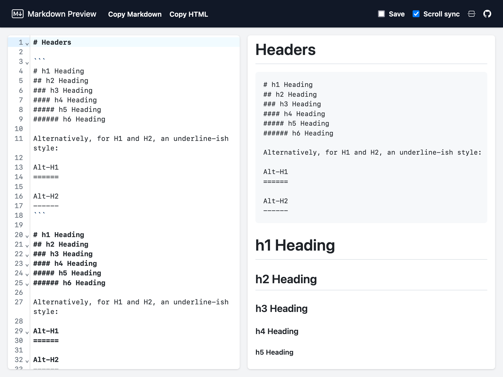

preview.md
==========

[](https://www.gnu.org/licenses/agpl-3.0)

This is a repository used for [preview.md](https://preview.md) - an online 
Markdown editor with live preview.



## Features

- Github-inspired Markdown rendering, including syntax highlighting in the code blocks.
- Support for [Github-Flavored Markdown](https://github.github.com/gfm/).
- Markdown syntax highlighting in the editor.
- Syntax highlighting in the code blocks in the editor.
- Scroll synchronization.
- Copy raw markdown or resulting HTML with one click.
- Change panes orientation (horizontal / vertical).
- Mobile support.
- Saving state, including content, in local storage.

## Requirements

- node.js v21.1.0
- yarn

## Installation

1. Clone the repository

   ```shell
   git clone https://github.com/potasiak/preview.md.git
   ```

2. Install dependencies

   ```shell
   cd preview.md/
   yarn
   ```
## Running

### Required environment variables

- `VITE_GA_TAG_ID` - Google Analytics Tag

### Development

```shell
yarn dev
```

### Production

```shell
yarn build
yarn preview  # local HTTP server serving built application
```

## Credits

- [Sebastian Potasiak](https://github.com/potasiak)
